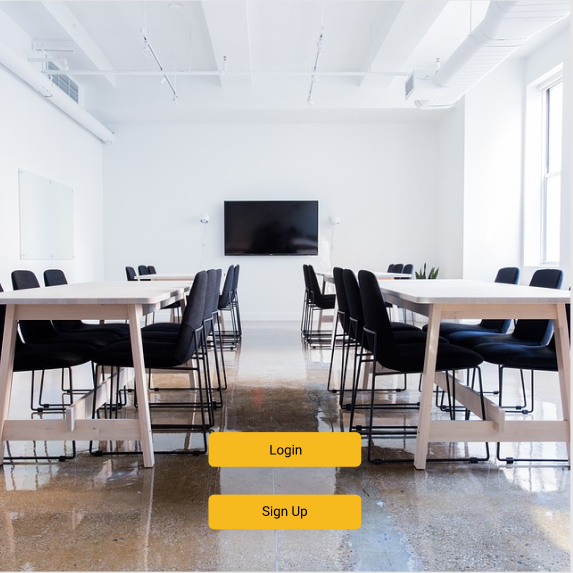
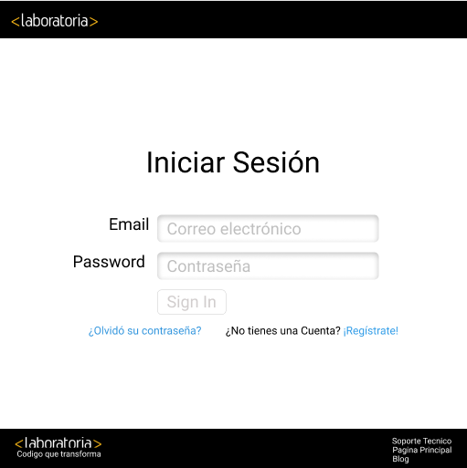
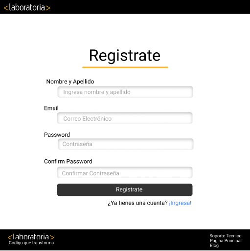
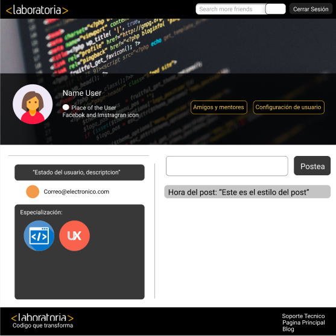
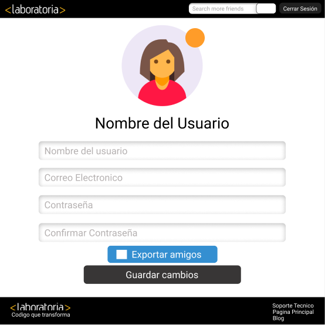
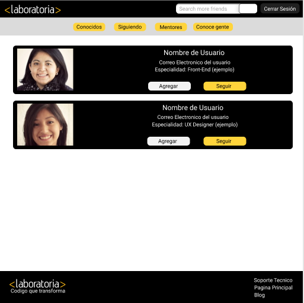
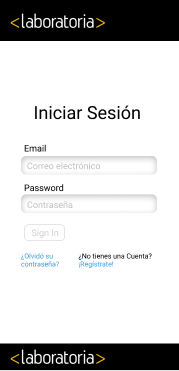
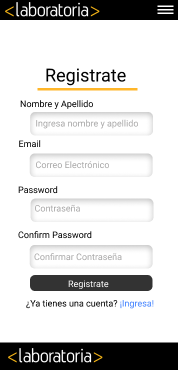
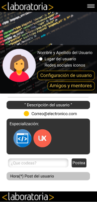
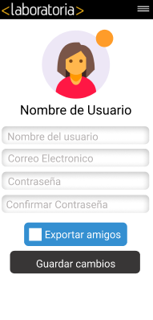

# Reto de Código - SocialLab

* **Track:** _Common Core_
* **Curso:** _Crea tu propia red social_
* **Unidad:** _Crea tu red Social X_

***

## Objetivo

Este reto consiste en realizar una página, para ello se utilizará una estructura específica dada por Laboratoria y un frameworks, jQuery, javaScript , red de grillas - flex-box y FireBase. 

## Especificaciones

* Perfiles de usuarios
* Un newsfeed donde puedes ver las actualizaciones de todos tus contactos
* Un lugar donde poder escribir posts
* Un lugar para subir fotos
* Capacidad para poder tener amigos o para poder seguir a personas/marcas dentro de la red social
* Ser mobile friendly

## ¿QUÉ SE REQUIERE?

* Trabajar en parejas
* Tener una planificación
* La definición del diseño
* Diseño mobile friendly
* Desplegar el producto en Github Pages
* Opcional, si se desarrolla un login o se desea almacenar la información en una base de datos, usar Firebase.

## La estructura de la página es la siguiente:

### Vista desktop:
* Inicio (Antes dando un splash de inicio de unos segundos).

;

* Inicio de Sesión.

;

* Registro de usuario Nuevo.

;

* Perfil del usuario.

;

* Configuración de usuario.

;

* Amigos y Mentores.

;

### Vista mobile:

* El inicio de usuario es similar a la misma vista de Desktop.
* Inico de Sesión.

;

* Registro de usuario nuevo.

;

* Perfil del usuario.

;

* Configuración de usuario.

;

* Amigos y Mentores.

;

* Pagina donde se realizo el MockUp [SocialLab MockUp](https://www.figma.com/file/gYU3MapcmZ1z1Dx5VkzBcso5/SocialLab)

### Realizado por:
* [Yolanda Ventura Chavez](https://github.com/YolandaVenturaChz)
* [Daniela Centeno Ramos](https://github.com/DDCenteno)